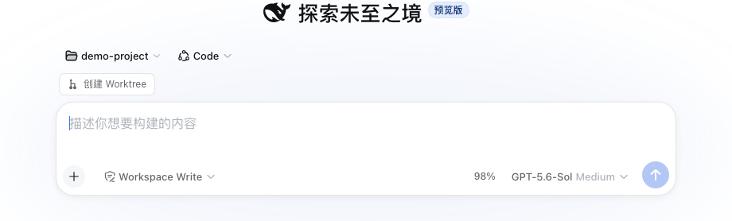

# dsh-worktree

A Git worktree plugin for DeepSeek Harness that creates task branches, registers worktrees as DSH Workspaces, and opens isolated sessions.

> npm package: `@alpacachen/dsh-simple-worktree`

[](https://www.npmjs.com/package/@alpacachen/dsh-simple-worktree)

[](https://awesome-dsh-plugin.com)


[Simplified Chinese](README.zh.md) · **English**



## Features

- Create a Git worktree from the new-session action in any Git Workspace.
- Choose the current branch or the repository's main branch.
- Register and open the new worktree as a DSH Workspace with an isolated session.
- Create task branches as `task/<name>`.
- Manage and remove linked worktrees from the **Worktree Management** settings page.
- No additional service or project configuration.
- Supports DSH themes, Chinese, and English.

## Compatibility

Built against the DSH **0.1.5** client contract (`0.1.5-rc.1 || 0.1.5-rc.2`, web profile).

## Usage

### Install

```sh
dsh plugin --profile web add @alpacachen/dsh-simple-worktree
```

Restart `dsh web` after installation.

You can also install from GitHub with `dsh plugin --profile web add github:alpacachen/dsh-worktree`.

### Create from a new session

1. Open **New Session** in a Git Workspace.
2. Choose **Create worktree** above the composer.
3. Enter a task name. The repository's main branch is selected by default.
4. Click **Create and open**.

### Manage worktrees

Open **Settings → Worktree Management** to scan every Workspace for Git projects and linked worktrees, inspect their branch and dirty state, and remove worktrees that are no longer needed.

The worktree is created at:

```text
project.worktrees/login-fix/
└── branch: task/login-fix
```

The new Workspace is named `<parent>/<task>`. Removing the worktree Workspace does not delete its Git branch.
